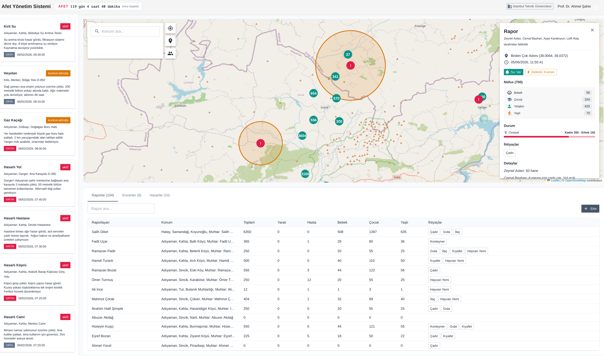
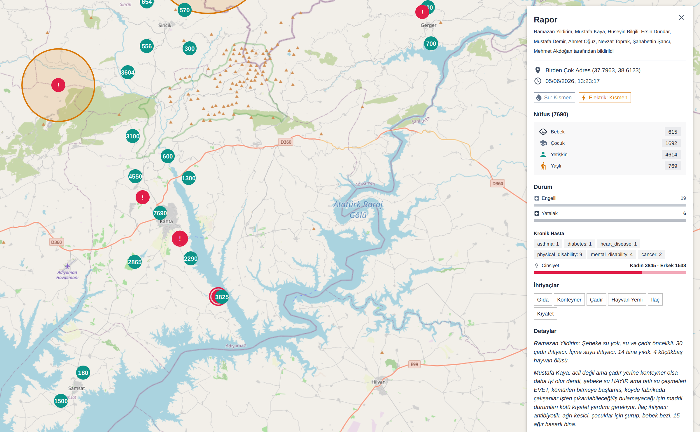
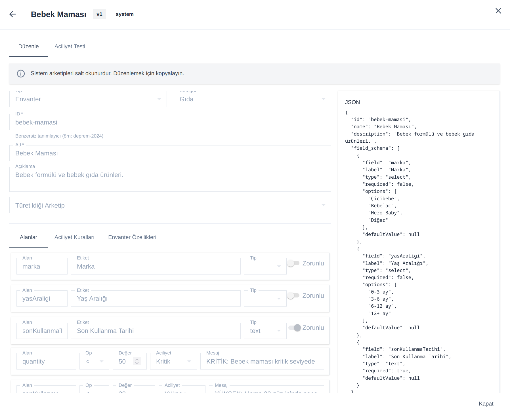

# Disaster Information and Resource Management System(DIRMS)
The Disaster Information and Resource Management System (DIRMS) is a 
collaborative web dashboard designed for NGOs, government agencies, and private 
organizations to monitor, coordinate, and respond to emergency situations 
through real-time data and interactive mapping. The platform serves as a 
central hub for sharing resources, exchanging critical information, and 
tracking affected populations and available supplies across all stakeholders.
Natural disasters and humanitarian emergencies demand rapid, coordinated action 
from a wide range of civil organizations. In practice, however, these efforts 
are often fragmented and siloed. This lack of coordination can leave some 
regions overlooked while others receive a surplus of aid that exceeds immediate 
needs. With structured data, unified tracking, and inter-organizational 
collaboration, the delivery of resources can be planned more efficiently, 
ensuring help reaches the right people at the right time.

## Features
- **Shared Incident and People Reporting:** All participating organizations have 
access to reports submitted across the platform, enabling real-time 
collaboration and eliminating duplicated efforts. Incidents, affected 
individuals, and resource requests are visible to every authorized stakeholder 
as soon as they are logged.
- **Geospatial Awareness:** Reporter and incident locations are captured and 
visualized on interactive maps, giving responders a clear operational picture 
of where help is needed most. This spatial context enables more effective route 
planning, resource distribution, and field coordination.
Data driven decision making mechanism: Needs, resources, and affected 
populations are tracked through structured, standardized data models. This 
allows organizations to prioritize critical cases, allocate supplies based on 
verified demand, and make informed strategic decisions rather than relying on 
anecdotal reports.
- **Multi-Organization Collaboration:** NGOs, government agencies, universities, and 
private companies can operate within a unified ecosystem while maintaining 
their own workflows, ensuring transparency without sacrificing organizational 
autonomy.
- **Archetypes DSL:** Archetypes are a data-driven framework to
standardize inventory management. It is a JSON-based DSL to match
victims' needs with inventory. The DSL can describe custom logic for
each inventory item based on medical condition or age group. This DSL
knowledge base is shared among all DIRMS members, removing
unnecessary data duplication.

Once a DSL entry is defined, users can either use that data directly or
use a custom inheritance system to define identifiers for a new entry. It
works by treating archetypes as reusable "class" definitions; templates
that define what data to collect, how to assess urgency, and what needs
are implied while actual reports and inventory entries are lightweight
"instances" that reference an archetype by ID.

